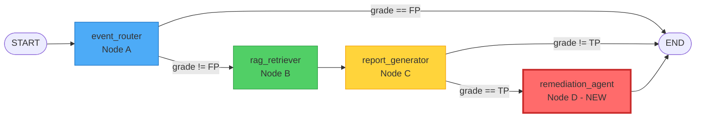

# Design Document: RemediationAgent

## Overview

The RemediationAgent is a new LangGraph node (Node D) that extends Sentinel-Core's security orchestration pipeline with autonomous remediation capabilities. It automatically executes security remediation actions—Kubernetes YAML patches or process termination via SIGKILL—based on ML-triaged security events. The agent integrates seamlessly after the report_generator node, consuming fully enriched security context (MITRE techniques, confidence scores, and pre-generated YAML fixes) to make intelligent remediation decisions. It supports three autonomy modes (autonomous, tiered, human-in-loop) with confidence-based gating to ensure safe execution, and provides comprehensive audit logging for compliance and debugging.

## Architecture

### Updated LangGraph Topology



### Component Architecture

```mermaid
graph TD
    subgraph "RemediationAgent Node D"
        RA[RemediationAgent<br/>Main Orchestrator]
        CM[Config Manager]
        DG[Decision Gate]
        RE[Routing Engine]
        EE[Execution Engine]
        AL[Audit Logger]
    end
    
    subgraph "External Systems"
        K8S[Kubernetes API]
        REDIS[Redis<br/>Audit Trail]
        API[REST API<br/>Config Endpoint]
    end
    
    RA --> CM
    RA --> DG
    RA --> RE
    RA --> EE
    RA --> AL
    
    CM -.->|read config| API
    DG -.->|check confidence| CM
    RE -.->|route action| EE
    EE -.->|kubectl apply| K8S
    EE -.->|kubectl exec kill| K8S
    AL -.->|log events| REDIS
    
    style RA fill:#ff6b6b,stroke:#c92a2a,stroke-width:3px
    style EE fill:#ffd43b,stroke:#f59f00
    style K8S fill:#326ce5,stroke:#1a4d8f
